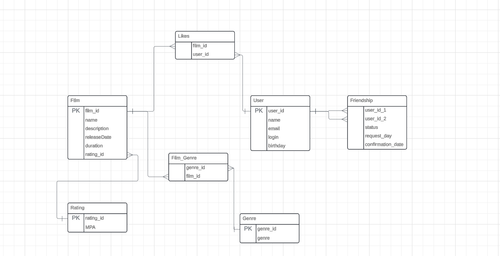

# java-filmorate
Template repository for Filmorate project.



## Main queries
___

### getAllFilmsWithGenreAndRating
```sql
SELECT f.name AS film_name, 
       g.genre AS genre_name, 
       r.MPA AS rating
FROM Film f
INNER JOIN Film_Genre fg ON f.film_id = fg.film_id
INNER JOIN Genre g ON fg.genre_id = g.genre_id
INNER JOIN Rating r ON f.rating_id = r.rating_id;
```

### getAllUsers
```sql
SELECT *
FROM User
```

### getUserById
```sql
SELECT * 
FROM user 
WHERE user_id = userId
```

### getFriendsList
```sql
SELECT u1.name AS user_name,
       u2.name AS friend_name,
       f.status,
       f.confirmation_date
FROM Friendship f
INNER JOIN User u1 ON f.user_id_1 = u1.user_id
INNER JOIN User u2 ON f.user_id_2 = u2.user_id
WHERE u1.user_id = <user_id> OR u2.user_id = <user_id>;
```

### getAllFilmsByGenre
```sql
SELECT f.name, 
       f.releaseDate, 
       g.genre
FROM Film f
INNER JOIN Film_Genre fg ON f.film_id = fg.film_id
INNER JOIN Genre g ON fg.genre_id = g.genre_id
WHERE g.genre = 'Genre';
```